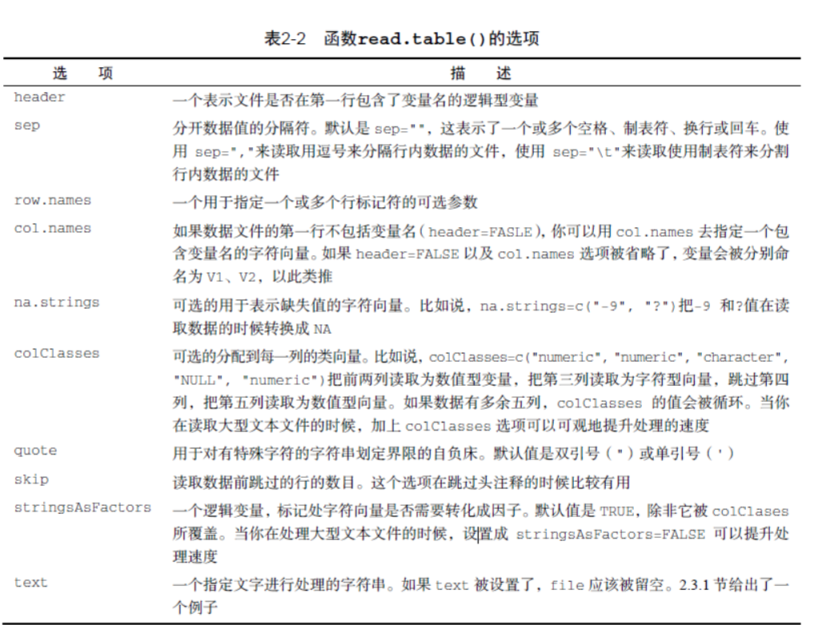

## 读取文件
### 读取txt文件
带分隔符的文本文件导入数据
```r
mydataframe <- read.table(file, options)
```


默认地，read.table()把字符变量转化为因子加上选项,stringsAsFactors=FALSE对所有的字符变量都去掉这个行为
### 读取excle数据
安装xlsx包，需要依赖的rJava，xlsxjars，并且需要本地安装java，并且配置好java环境
[Windows环境下JDK安装与环境变量配置详细的图文教程](http://www.cnblogs.com/liuhongfeng/p/4177568.html)
```r
> library('xlsx')
> path  <- 'C:\\Users\\HP\\Desktop\\示范sample.xlsx'
> df = read.xlsx(path,1,encoding= 'UTF-8')
> head(df)
        电影名称                           导演 年份           类型      制片国家 评分                       coupon
1   肖申克的救赎 弗兰克·德拉邦特 Frank Darabont 1994      犯罪/剧情          美国  9.6                 希望让人自由
2 这个杀手不太冷           吕克·贝松 Luc Besson 1994      动作 犯罪          法国  9.4 怪蜀黍和小萝莉不得不说的故事
3       霸王别姬                         陈凯歌 1993      爱情 同性 中国大陆 香港  9.5                     风华绝代
4       阿甘正传                Robert Zemeckis 1994           爱情          美国  9.4             一部美国近现代史
5       美丽人生  罗伯托·贝尼尼 Roberto Benigni 1997 喜剧 爱情 战争        意大利  9.5                   最美的谎言
6       千与千寻          宫崎骏 Hayao Miyazaki 2001      动画 奇幻          日本  9.2   最好的宫崎骏，最好的久石让
```
注意：read.xlsx()读取中文需要设置 encoding = 'UTF-8'，否则读取的中文是乱码;

##　数据库mysql 读取及写入数据
```R
library('RMySQL')
#建立连接
con <- dbConnect(MySQL(),host="127.0.0.1",dbname="r_db",user="root",password="123456")  
# #获取连接信息，查看r_db下所有表，以及删除testname表
summary(con)  
dbGetInfo(con)  
dbListTables(con)  # 查看r_db下所有表
dbRemoveTable(con,"test") # 删除testname表
##  R语音-MySQL连接汉字乱码问题集解决
dbSendQuery(con,'SET NAMES gbk')

## 读取数据数据
dbReadTable(con,"fruits_gbk")#中文出现乱码，这是因为字符编码格式不统一的问题
## 读取数据
#用SQL语句查询dbGetQuery()和dbSendQuery()两种方法  
dbGetQuery(con, "SELECT * FROM fruits_gbk")  
query  <- dbSendQuery(con, "SELECT * FROM fruits_gbk")  
dbFetch(query, n=6) #取前6条数据，n=-1时是获取所有数据  

#写数据表，覆盖追加
fruits <-data.frame(id=1:5,name=c("苹果","香蕉","梨子","玉米","西瓜"),price=c(8.8,4.98,7.8,6,2.1),
                    status=c("无","打折","无","售罄","批发"))
dbWriteTable(con,"fruits",fruits,append = T)
# 关闭连接
dbDisconnect(con)
```
