<!-- TOC depthFrom:1 depthTo:6 withLinks:1 updateOnSave:1 orderedList:0 -->

- [R语言之ggplot2画图篇](#r语言之ggplot2画图篇)
	- [ggplot2 基本介绍 library(ggplot2)](#ggplot2-基本介绍-libraryggplot2)
	- [数据集：mpg](#数据集mpg)
	- [基本图形](#基本图形)
		- [散点图  ：geom_point()](#散点图-geompoint)
		- [将年份映射到颜色属性   aex(x=,y=,colour =factor(year))](#将年份映射到颜色属性-aexxycolour-factoryear)
		- [增加平滑线 :stat_smooth()](#增加平滑线-statsmooth)
		- [两种等价的绘图方式](#两种等价的绘图方式)
		- [用标度来修改颜色取值  scale_color_manual(values=c("blue","red"))](#用标度来修改颜色取值-scalecolormanualvaluescbluered)
		- [将排量映射到散点大小](#将排量映射到散点大小)
		- [用坐标控制图形显示的范围](#用坐标控制图形显示的范围)
		- [利用facet分别显示不同年份的数据](#利用facet分别显示不同年份的数据)
		- [增加图名并精细修改图例](#增加图名并精细修改图例)
	- [直方图](#直方图)
		- [- 直方图的几何对象中内置有默认的统计变换](#-直方图的几何对象中内置有默认的统计变换)
	- [条形图 : geom_bar()](#条形图-geombar)
		- [条形图排序](#条形图排序)
		- [条形图](#条形图)
		- [条形图 并立方式](#条形图-并立方式)
		- [条形图 叠加方式](#条形图-叠加方式)
		- [条形图 相对比例](#条形图-相对比例)
		- [条形图分面显示](#条形图分面显示)
	- [饼图](#饼图)
	- [箱线图](#箱线图)
		- [- 箱线图](#-箱线图)

<!-- /TOC -->
#  R语言之ggplot2画图篇
##  ggplot2 基本介绍 library(ggplot2)

<table class="table table-bordered table-striped table-condensed">
  <tr>
    <td> 数据（Data）和映射（Mapping）</td>
    <td> 将数据中的变量映射到图形属性，映射控制了二者之间的关系</td>
  <tr>
  <tr>
    <td> 标度（Scale）  </td>
    <td> 标度负责控制映射后图形属性的显示方式，具体形式上看是图例和坐标刻度</td>
  <tr>
  <tr>
    <td> 几何对象（Geometric）</td>
    <td> 几何对象代表我们在图中实际看到的图形元素，如点、线、多边形等</td>
  <tr>
  <tr>
    <td>统计变换（Statistics）</td>
    <td>对原始数据进行某种计算，如对二元菜点图加上一条回归线</td>
  <tr>
  <tr>
    <td>坐标系统（Coordinate）坐标系统控制坐标轴并影响所有图形元素，坐标轴可以进行变换以满足不同的需要</td>
    <td>对原始数据进行某种计算，如对二元菜点图加上一条回归线</td>
  <tr>
  <tr>
    <td>图层（Layer）</td>
    <td>数据、映射、几何对象、统计变换等构成一个图层，图层可以允许用户一步步的构建图形，方便单独对图层进行修改</td>
  <tr>
  <tr>
    <td>分面（Facet）</td>
    <td>条件绘图，将数据按某种方式分组，然后分别绘图。分布就是控制分组绘图的方式和排列形式</td>
  <tr>
<table>

ggplot2图形对象是包含数据、映射、图层、标度、坐标和分面的列表，ggplot2绘图采用逐层叠加


## 数据集：mpg
数据介绍：
加载了 ggplot2 包后，里面自带了一个 mpg 数据集，共 234 条观测，是有关车辆燃料的。11 个变量如下：
- 制造商：manufacturer
- 模具型号：model
- 排放量：displ (engine displacement, in litres)
- 年份：year
- 发动机数量：cyl (number of cylinders)
- 变速器形式：trans (type of transmission)
- 驱动形式：drv (f = front-wheel drive, r = rear wheel drive, 4 = 4wd)
- 每加仑公路行驶距离：hwy (highway miles per gallon)
- 燃料：fl (e: ethenol E85, d: diesel, r: regular, p: premium, c: CNG)
- 车辆类型：class


这里将主要利用这个数据集进行绘图。
## 基本图形

### 散点图  ：geom_point()
```js
  library('ggplot2')
  map <- ggplot(data = mpg,mapping= aes(x=cty,y=hwy)) # 加载数据、映射  
  map + geom_point()
  summary(map)  ##查看数据结构
  summary(map+geom_point())  
  ggsave('plog.png',width=5,height=5)  ##保存图形
```

  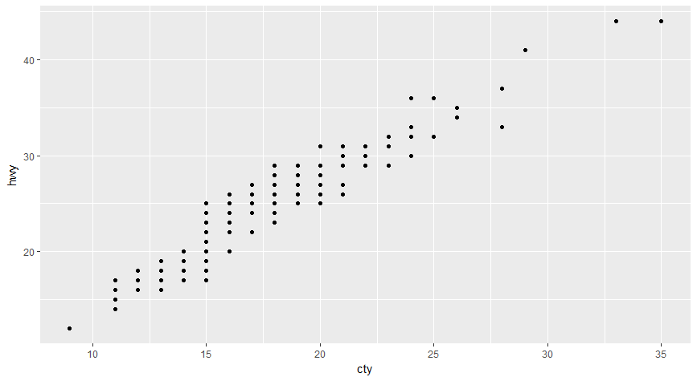
### 将年份映射到颜色属性   aex(x=,y=,colour =factor(year))
```js
  map<-ggplot(mpg,aes(x=cty,y=hwy,colour=factor(year)))  
  map+geom_point()
```
 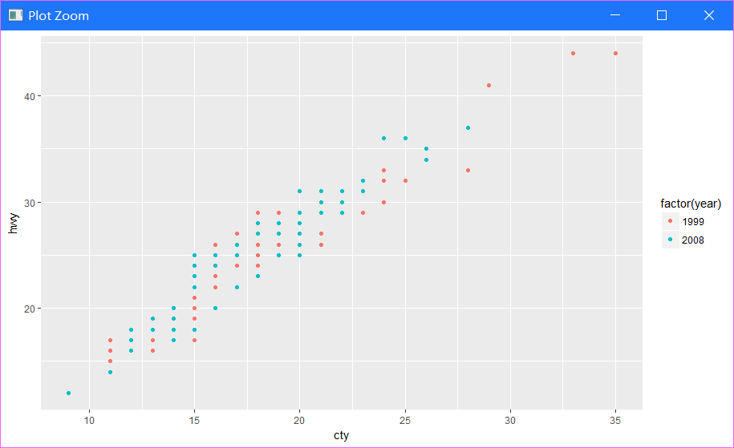
### 增加平滑线 :stat_smooth()
```js
	map<-ggplot(mpg,aes(x=cty,y=hwy,colour=factor(year)))  
  map+geom_point()+stat_smooth()
```
  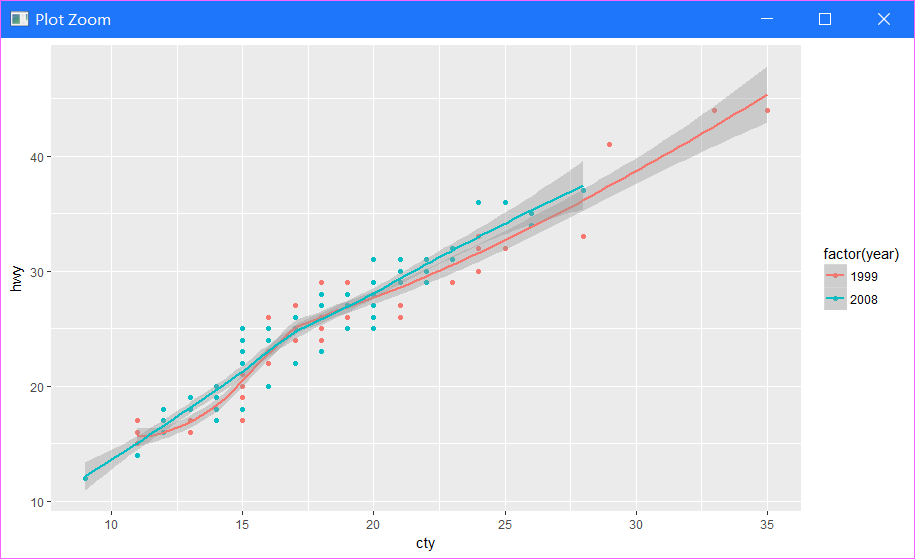

### 两种等价的绘图方式
```js
  #方法一  
  map<-ggplot(mpg,aes(x=cty,y=hwy))  
  map+geom_point(aes(colour=factor(year)))+stat_smooth()  
  #方法二  
  ggplot()+  
    geom_point(data=mpg,aes(x=cty,y=hwy,colour=factor(year)))+  
    stat_smooth(data=mpg,aes(x=cty,y=hwy))#此时除了底层画布外，有两个图层，分别定义了geom和stat  
```
### 用标度来修改颜色取值  scale_color_manual(values=c("blue","red"))
```js
  map<-ggplot(mpg,aes(x=cty,y=hwy))  
  map+geom_point(aes(colour=factor(year)))+stat_smooth()+scale_color_manual(values=c("blue","red"))
```
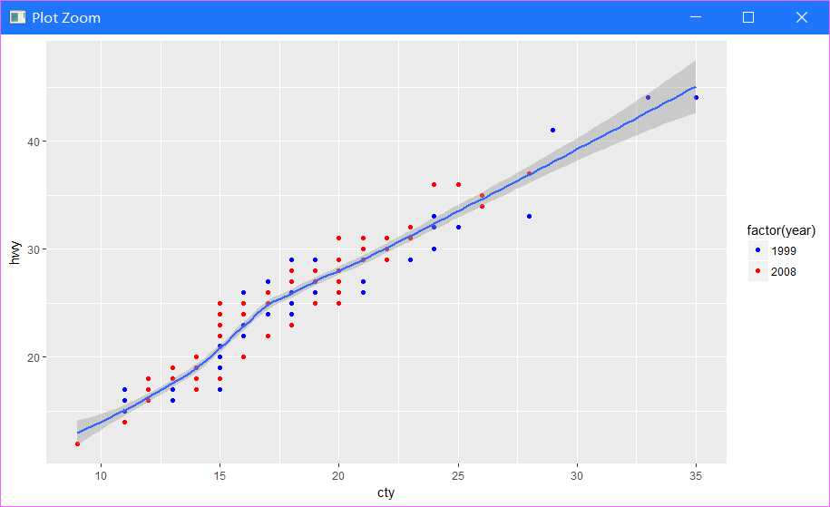
### 将排量映射到散点大小
```js
map+geom_point(aes(colour=factor(year),size=displ))+  
  stat_smooth()+  
  scale_color_manual(values=c("blue2","red4"))  
```
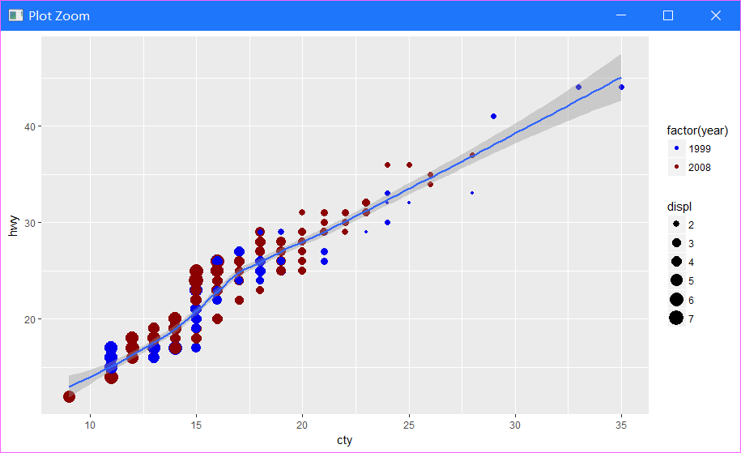

### 用坐标控制图形显示的范围
```js
map+geom_point(aes(colour=factor(year),size=displ),alpha=0.5,position="jitter")+  
  stat_smooth()+  
  scale_color_manual(values=c("blue2","red4"))+  
  scale_size_continuous(range=c(4,10))+  
  coord_cartesian(xlim=c(15,25),ylim=c(15,40))  
```
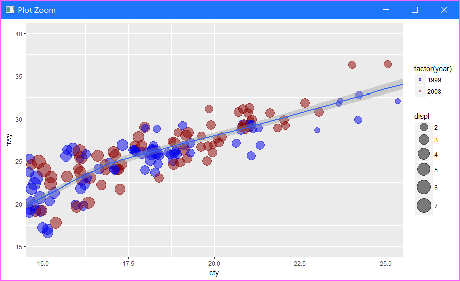

### 利用facet分别显示不同年份的数据
```js
map+geom_point(aes(colour=class,size=displ),alpha=0.5,position="jitter")+  
  stat_smooth()+  
  scale_size_continuous(range=c(4,10))+  
  facet_wrap(~year,ncol=1)  
```
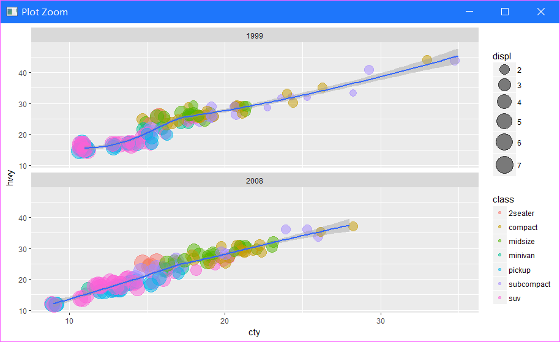
### 增加图名并精细修改图例
```js
map<-ggplot(mpg,aes(x=cty,y=hwy))  
map+geom_point(aes(colour=class,size=displ),alpha=0.5,position="jitter")+  
  stat_smooth()+  
  scale_size_continuous(range=c(4,10))+  
  facet_wrap(~year,ncol=1)+  
  labs(x="每加仑高速公路行驶距离",y="每加仑城市公路行驶距离")+  
  guides(size=guide_legend(title="排量"),colour=guide_legend(titile="车型",override.aes=list(size=5)))  
```
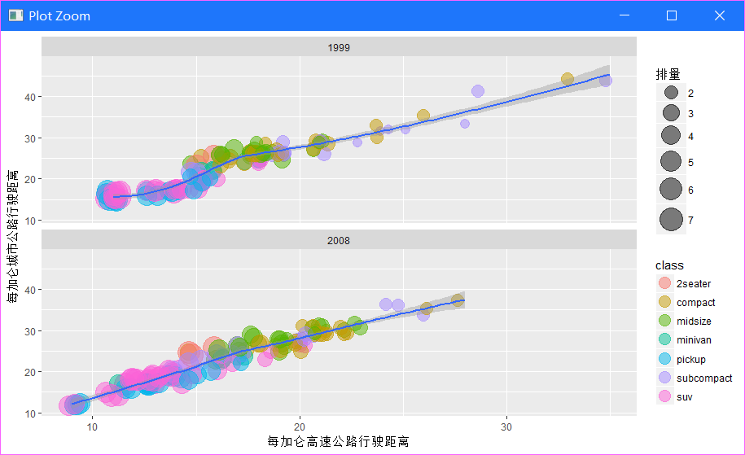

## 直方图
```js
map<-ggplot(mpg,aes(x=hwy))  
map+geom_histogram()  
```
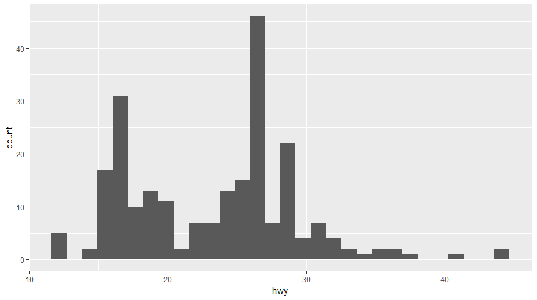

### - 直方图的几何对象中内置有默认的统计变换
```js
map+geom_histogram(aes(fill=factor(year),y=..density..),alpha=0.3,colour="black")+  
  stat_density(geom="line",position="identity",size=1.5,aes(colour=factor(year)))+  
  facet_wrap(~year,ncol=1)  
```
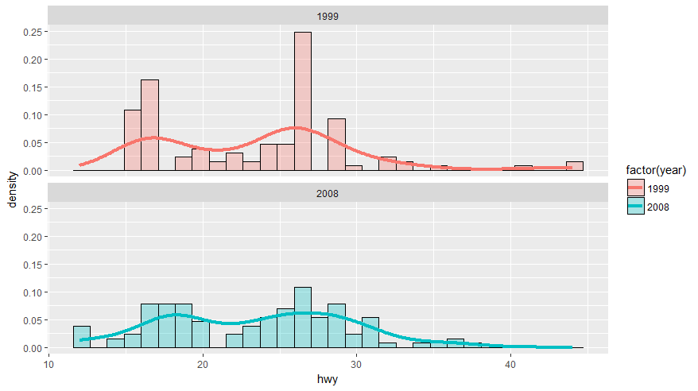

## 条形图 : geom_bar()
默认纵轴是 x 轴上各离散类的计数（Count），对应的默认参数是 geom_bar(stat="count")
```js
map<-ggplot(mpg,aes(x=class))  
map+geom_bar()
```
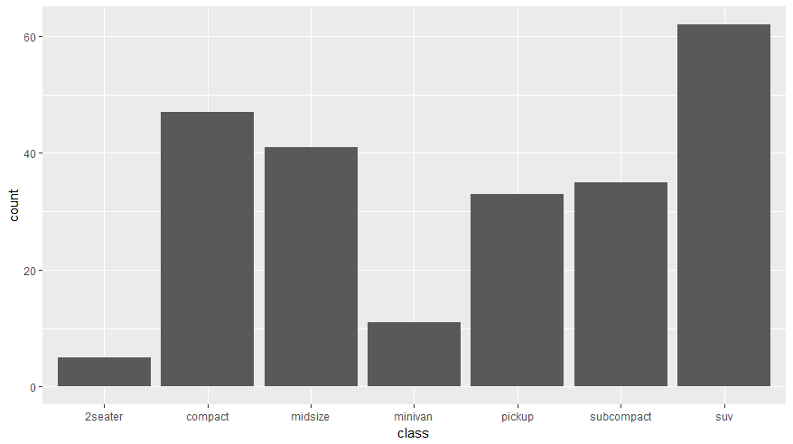

如果想用其他值代替，需要在 ggplot() 中指定 aes(y=) 参数，并且在条形图函数中改动为 geom_bar(stat="identity")。
```js
# 以各类内部的排放量作为对应的 y 值，进行累加
map = ggplot(mpg, aes(x=class, y=displ))
map +  geom_bar(stat="identity")
```
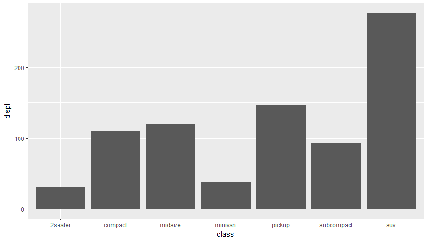

权重：aes(weight=)
下面的语句完成了同样的任务，只不过权重相当于使用了乘法。
```js
# 权重。计算每个 class 内的排放总量
map =ggplot(mpg, aes(class))
map+  geom_bar(aes(weight=displ))
```


###　　条形图排序
```js
＃对数据排序后，再画条形图，即可得到顺序条形图
class2<-mpg$class  
class2<-reorder(class2,class2,length)  
mpg$class2<-class2  
map<-ggplot(mpg,aes(x=class2))  
map+geom_bar(aes(fill=class2))
```
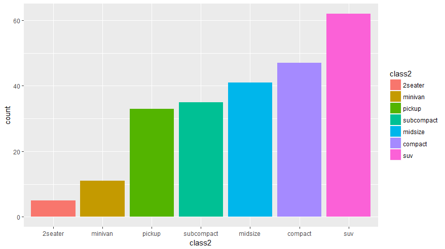

###　 条形图
```js
map<-ggplot(mpg,aes(class2,fill=factor(year)))  
map+geom_bar(position="identity",alpha=0.5)  
```
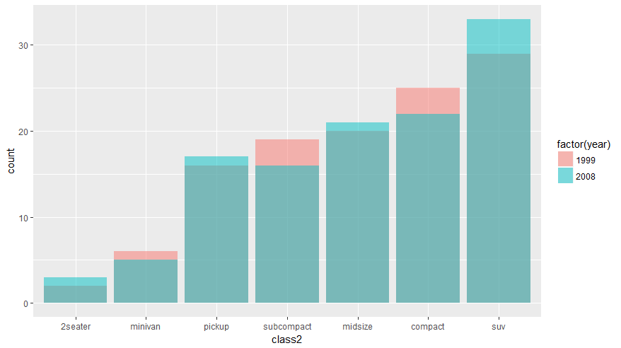

###   条形图 并立方式
```js
map<-ggplot(mpg,aes(class2,fill=factor(year)))  
map+geom_bar(position="dodge")
```
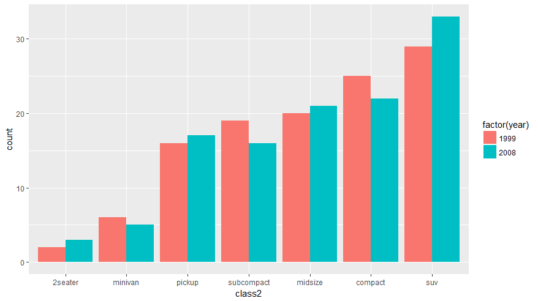

###  条形图 叠加方式
```js
map<-ggplot(mpg,aes(class2,fill=factor(year)))  
map + geom_bar(position="stack")  
```
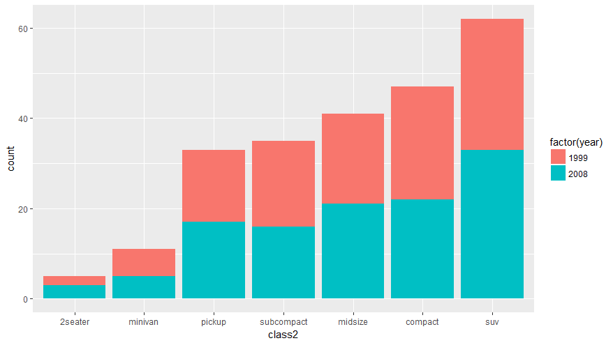
###  条形图 相对比例
```js
map<-ggplot(mpg,aes(class2,fill=factor(year)))
map+geom_bar(position="fill")  
```
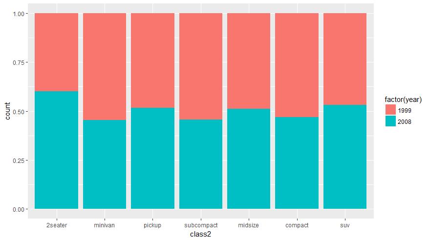
###   条形图分面显示
```js
map<-ggplot(mpg,aes(class2,fill=factor(year)))
map +geom_bar(aes(fill=class2))+facet_wrap(~year)
```
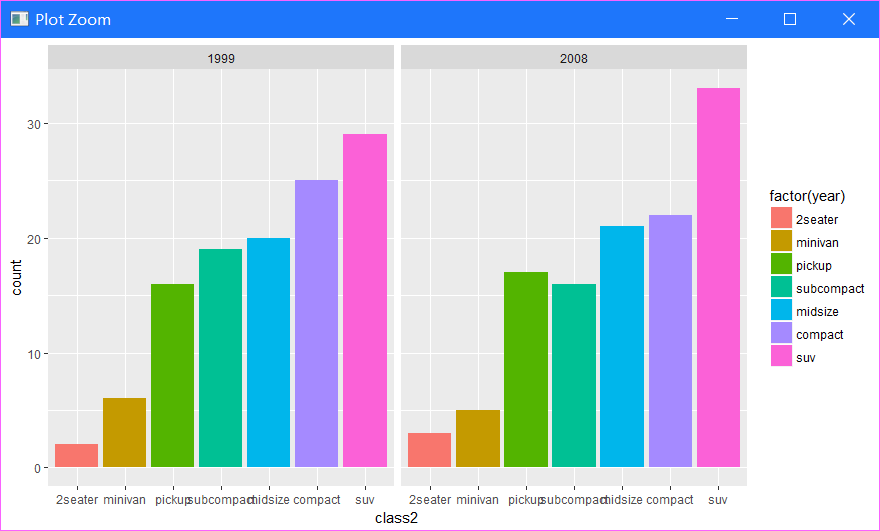

## 饼图
```js
map<-ggplot(mpg,aes(x=factor(1),fill=factor(class)))+geom_bar(width=1)  
map+coord_polar(theta="y")  
```
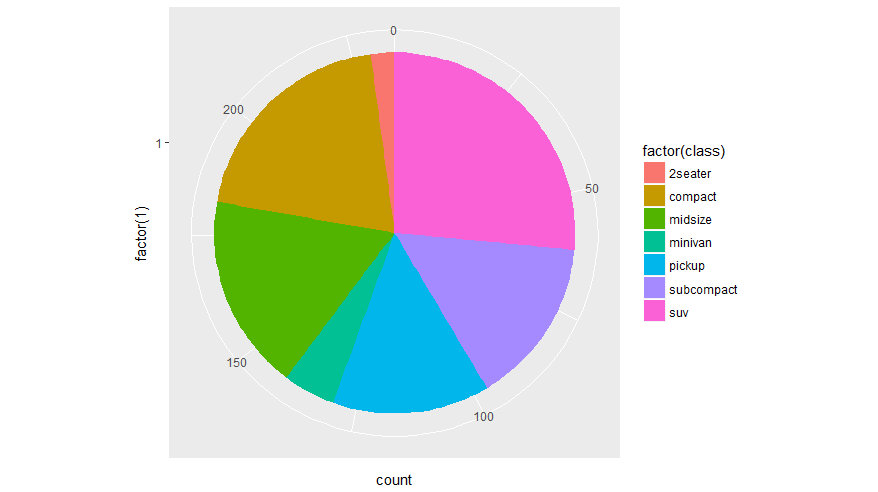

## 箱线图
```js
map<-ggplot(mpg,aes(class,hwy,fill=class))  
map+geom_boxplot()
```
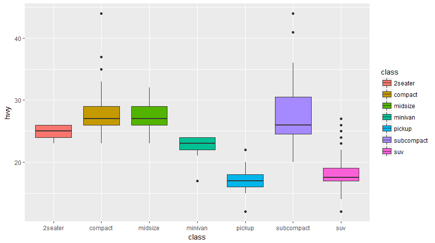
###  - 箱线图
```js
map<-ggplot(mpg,aes(class,hwy,fill=class))  
map+geom_violin(alpha=0.3,width=0.9)+geom_jitter(shape=21)  
```
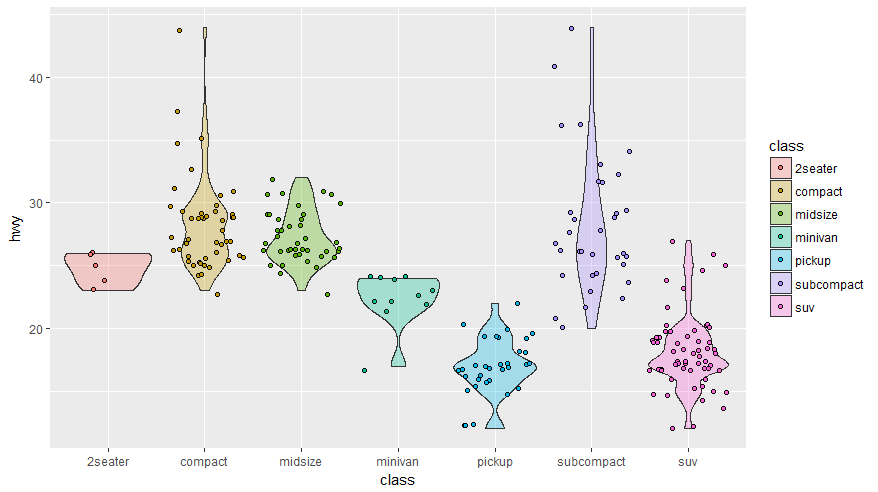

参考文章
[ggplot2 官方的函数索引教程](http://docs.ggplot2.org/current/)
[R语言之ggplot2画图篇](http://blog.csdn.net/lilanfeng1991/article/details/28665255)
[R语言（ggplot2绘图）](https://wklchris.github.io/R-ggplot2.html)
