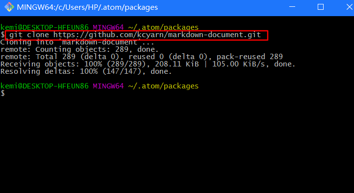

<!-- toc orderedList:0 depthFrom:1 depthTo:6 -->

* [atom markdown 用法及相关插件使用介绍](#atom-markdown-用法及相关插件使用介绍)
  * [atom-markdown 插件](#atom-markdown-插件)
    * [插件名称  markdown-img-paste 粘贴图片](#插件名称-markdown-img-paste-粘贴图片)
    * [插件名称 activate-power-mode 炫酷插件](#插件名称-activate-power-mode-炫酷插件)
    * [markdown-preview-enhanced markdown增强插件](#markdown-preview-enhanced-markdown增强插件)
    * [markdown-scroll-sync 预览与markdown同步](#markdown-scroll-sync-预览与markdown同步)
  * [atom -插件安装](#atom-插件安装)
    * [atom -插件安装 ---手动安装](#atom-插件安装-手动安装)
  * [markdown 站外插件 markdown 生成目录树](#markdown-站外插件-markdown-生成目录树)
    * [i5ting_toc markdown 目录树](#i5ting_toc-markdown-目录树)

<!-- tocstop -->

# atom markdown 用法及相关插件使用介绍
## atom-markdown 插件

###  插件名称  markdown-img-paste 粘贴图片
  描述：markdown-img-paste 可直接截图，使用`crtl + shift + v` 粘贴图片到文档，
  一个可以快速粘贴剪贴板里的照片到markdown的插件，并且可以设置使用七牛存储照片
  其使用了七牛做为图片库；
  插件github地址：[Markdown-img-paste](https://atom.io/packages/markdown-img-paste)
  简要说明：使用此插件需要申请七牛帐号，并获取七牛的开发密钥；

### 插件名称 activate-power-mode 炫酷插件
描述：让自己的字体动起来，炫酷插件；
github地址：[activate-power-mode](https://atom.io/packages/activate-power-mode)

### markdown-preview-enhanced markdown增强插件
描述： markdown 写作必备插件
支持特性
- 编辑与预览滑动同步
- 导入外部文件
- Code Chunks (beta)
- pandoc
- prince
- ebook
- Presentation Writer
- 支持扩展
- 数学编辑支持
- 你可以选择 MathJax 或者 KaTeX 来渲染数学表达式
- 导出 PDF, PNG, and JPEG 文件
- 导出 HTML （完美支持移动端设备）
- 编译成 Markdown 文件
- 自定义 Markdown Preview 样式（css）
- TOC 自动生成 (beta)
- Flowchart / Sequence 等各种图
- Task List 任务列表 (Github Flavored)
- 图片助手
- Footnotes
- Front Matter
github地址[Markdown Preview Enhanced](https://github.com/shd101wyy/markdown-preview-enhanced/blob/0.10.12/docs/README_CN.md)
使用安装:参考github介绍及使用

### markdown-scroll-sync 预览与markdown同步
描述：Auto-scroll markdown-preview tab to match markdown source.

## atom -插件安装

### atom -插件安装 ---手动安装
默认情况下，中国使用atom安装，总会失败，各种失败，各种错误；
这个就不要debug，默认都是服务器连接问题，被墙了，安装失败；

解决办法是：手动安装
直接下载github原始文件到本地，本体npm安装；
具体办法：
1.下载 插件到本地，存放到.../.atom/packages 目录
2.使用cmd 命令 cd .../.atom/packages 目录下，执行npm install 插件文件夹名称
示范：安装 markdown-document
1. 步骤1 进入到 .atom/packages目录：

2. 步骤2：右键 git bash here ，将 markdown-document文件下载到本地 .atom/packages 目录

3. 下载文件如图所示：

4. cmd 命令到 .atom/packages目录：

5. OK,安装完毕，重启Atom软件，good；

## markdown 站外插件 markdown 生成目录树
### i5ting_toc markdown 目录树
markdown 生成目录树

github地址[i5ting_toc](https://github.com/i5ting/tocmd.npm)
1. Install   npm install -g i5ting_toc
2. Usage  

➜  tocmd.npm git:(master) ✗ i5ting_toc -h

  Usage: i5ting_toc  a node npm wrapper of i5ting_ztree_toc https://github.com/i5ting/i5ting_ztree_toc

  Options:

    -h, --help             output usage information
    -V, --version          output the version number
    -f, --file [filename]  default is README.md
		-o, --open             open in browser
    -v, --verbose  
  这个版本的命令比较简单，只有一个-f参数，如果没有填写，默认使用README.md，常见用法

    i5ting_toc -f sample.md -o

cmd 命令行执行
1. cmd cd .md 文件的目录
2. 再执行i5ting_toc -f sample.md -o
